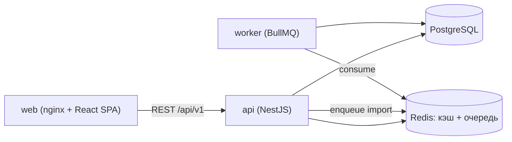
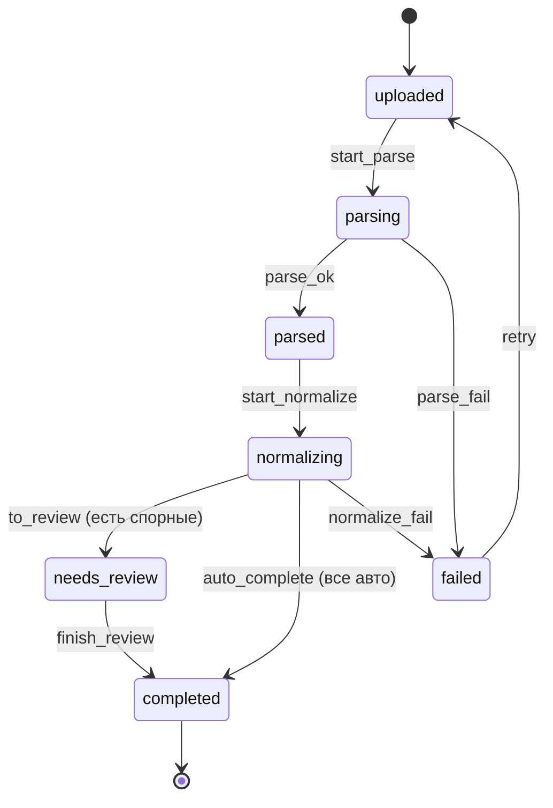
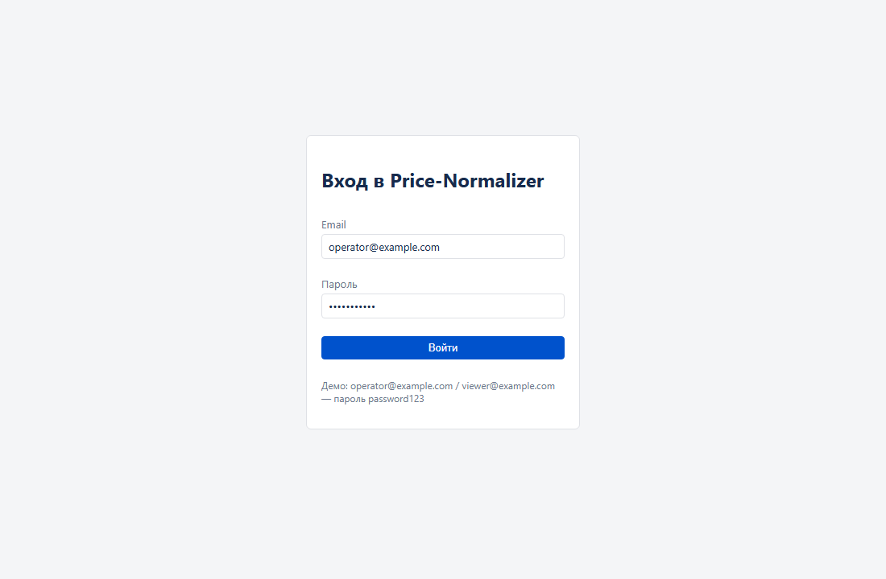

# Price-Normalizer — нормализатор прайс-листов поставщиков

Сервис превращает хаотичные прайс-листы поставщиков (CSV/XLSX с разными
заголовками, кодировками, форматами чисел) в единый чистый каталог с ценами и
сопоставляет позиции с эталонной номенклатурой («это тот же товар»). Компаньон к
системе закупок [Mini-SRM](#интеграция-с-mini-srm): готовит для неё чистые данные.

Pet-проект, демонстрирующий полный цикл разработки по принципу **spec-first**
([SPEC.md](SPEC.md)) с упором на инженерную проверку AI-сгенерированного кода —
все ключевые решения и найденные/исправленные баги задокументированы в
[DECISIONS.md](DECISIONS.md).

## Возможности

- **Конвейер обработки прайса** со строгой серверной валидацией переходов стадий: `uploaded → parsing → parsed → normalizing → needs_review → completed` (+ `failed` с восстановлением через `retry`). Недопустимый переход → `409`.
- **Нормализация «хаос → структура»**: числа (`1 234,56` → `1234.56`), единицы (`шт`→`pcs`), валюты, названия; авто-определение заголовка и разделителя.
- **Матчинг**: точный по артикулу → fuzzy по названию (коэффициент Дайса) с порогами; спорные позиции уходят на ручной разбор с кандидатами.
- **Роли**: `operator` (загрузка, разбор, ведение справочников) и `viewer` (чтение). JWT-аутентификация.
- **Redis**: кэш каталога с инвалидацией, фоновая обработка батча через BullMQ-воркер, rate limiting на логин и загрузку.
- **Экспорт** чистого каталога для Mini-SRM (JSON/CSV).
- **Фронтенд**: загрузка прайсов + список со статусами, экран разбора матчей, каталог и сравнение цен по товару.

## Технологический стек

| Слой | Технологии |
|------|-----------|
| Бэкенд | Node.js, TypeScript (strict), NestJS, TypeORM |
| БД / кэш / очередь | PostgreSQL, Redis, BullMQ |
| Фронтенд | React 18, TypeScript, Vite, TanStack Query |
| Инфраструктура | Docker, Docker Compose, nginx |
| Качество | Jest, ESLint, GitHub Actions |

## Архитектура



- **api** — REST-API, бизнес-логика (роутеры → сервисы → сущности), кладёт задачи обработки в очередь.
- **worker** — отдельный процесс, выполняет тяжёлый пайплайн parse → normalize → match.
- **redis** — кэш эталонного каталога, очередь BullMQ, счётчики rate limit.
- **web** — собранный React-бандл, отдаётся nginx.

### Конвейер обработки прайса



Единственный источник истины — таблица переходов в
[`backend/src/common/pipeline/batch-transitions.ts`](backend/src/common/pipeline/batch-transitions.ts).

## Скриншоты

Вход в систему:



> Экраны загрузки прайсов, разбора матчей и каталога доступны после запуска
> полного стека (нужна поднятая БД) — см. «Быстрый старт».

## Быстрый старт (Docker Compose)

Требуется Docker с плагином Compose.

```bash
# 1. Переменные окружения
cp .env.example .env
# отредактируйте JWT_SECRET (например: openssl rand -hex 32)

# 2. Поднять всю систему
docker compose up --build
```

`api` дождётся готовности БД и Redis, **применит миграции** и **засеет** двух
пользователей и демо-данные, затем стартуют API, воркер и веб.

| Сервис | URL |
|--------|-----|
| Веб-интерфейс | http://localhost:5173 |
| API | http://localhost:8000/api/v1 |
| Health-check | http://localhost:8000/api/v1/health |

### Демо-учётные записи

| Роль | Email | Пароль |
|------|-------|--------|
| Оператор | `operator@example.com` | `password123` |
| Наблюдатель | `viewer@example.com` | `password123` |

## Локальная разработка (без Docker)

Нужны запущенные PostgreSQL и Redis.

**Бэкенд:**
```bash
cd backend
npm install
cp .env.example .env   # заполните DB_*/REDIS_*/JWT_SECRET
npm run migration:run  # применить миграции
npm run start:dev      # http://localhost:8000
```

**Фронтенд:**
```bash
cd frontend
npm install
npm run dev            # http://localhost:5173
```

## Тесты и качество

```bash
# Бэкенд — тесты идут на sql.js с отключённым Redis, внешние сервисы не нужны
cd backend
npm run lint
npm test

# Фронтенд
cd frontend
npm run lint
npm run build
```

Покрытие: таблица переходов стадий (вкл. **запрет недопустимого перехода → 409**),
нормализация, матчинг, rate-limit guard, а также e2e на аутентификацию, роли,
справочники и полный цикл батча (загрузка → матчинг → разбор → завершение).

## CI/CD

[GitHub Actions](.github/workflows/ci.yml) на каждый push/PR:

1. **backend** — ESLint + Jest;
2. **frontend** — ESLint + сборка;
3. **docker-build** — сборка всех образов (`docker compose build`).

## Основные API-эндпоинты

Префикс `/api/v1`.

| Метод | Путь | Описание |
|-------|------|----------|
| POST | `/auth/login` | Вход, JWT (rate limited) |
| GET | `/suppliers`, `/products` | Справочники (каталог кэшируется) |
| POST | `/batches` | Загрузка прайса (multipart) → 202, в очередь (rate limited) |
| GET | `/batches/:id` | Батч + счётчики/прогресс |
| GET | `/batches/:id/offers?status=needs_review` | Спорные позиции с кандидатами |
| POST | `/batches/:id/transition` | Переход стадии (`finish_review`/`retry`) |
| POST | `/offers/:id/resolve` | Разбор позиции (`confirm｜match｜new｜reject`) |
| GET | `/products/:id/offers` | Сравнение цен по товару |
| GET | `/export/catalog` | Экспорт каталога для Mini-SRM |

## Интеграция с Mini-SRM

Price-Normalizer отдаёт чистый сопоставленный каталог, который система закупок
Mini-SRM импортирует как номенклатуру (`Material`).

**Эндпоинт:** `GET /api/v1/export/catalog?format=json|csv&mode=best|all`
- `mode=best` (по умолчанию) — по одной, самой низкой цене на товар;
- `mode=all` — все цены по поставщикам;
- `format=csv` — выгрузка файлом.

**Пример:**
```bash
curl -H "Authorization: Bearer <token>" \
  "http://localhost:8000/api/v1/export/catalog?mode=best"
```
```json
[
  {
    "productId": 1,
    "name": "Цемент М500",
    "article": "CEM500",
    "category": "Вяжущие",
    "unit": "pack",
    "supplier": "СтройБаза",
    "price": "450.50",
    "currency": "RUB"
  }
]
```

**Маппинг в Mini-SRM `Material`:** `name → name`, `unit → unit`, `category → category`,
`price → base_price`. Таким образом справочник материалов Mini-SRM наполняется
уже нормализованными данными от поставщиков, без ручного ввода.

### Как проверить связку

Скрипт-мост [`scripts/sync-to-mini-srm.mjs`](scripts/sync-to-mini-srm.mjs) тянет
`/export/catalog` из Price-Normalizer и создаёт материалы в Mini-SRM через его API.

Так как оба проекта используют одни порты, Mini-SRM поднимается на сдвинутых
(api `8001`) отдельным проектом:

```bash
# 1. Price-Normalizer уже запущен на :8000 (docker compose up)
# 2. Mini-SRM на сдвинутых портах (api :8001), отдельным проектом
cd ../mini-SRM
docker compose -p mini-srm-int -f docker-compose.integration.yml up -d --build

# 3. Перелить каталог Price-Normalizer → Mini-SRM
node ../pet-project/scripts/sync-to-mini-srm.mjs
# → "Интеграция проверена: каталог Price-Normalizer загружен в Mini-SRM."

# 4. Остановить интеграционный Mini-SRM
docker compose -p mini-srm-int -f docker-compose.integration.yml down
```

## Структура проекта

```
pet-project/
├── backend/          # NestJS: auth/ suppliers/ products/ imports/ offers/ export/ health/
│   ├── src/common/   # pipeline (таблица переходов), normalization, matching, rate-limit
│   ├── src/database/ # TypeORM data-source + миграции
│   ├── src/worker.ts # точка входа BullMQ-воркера
│   └── test/         # Jest (unit + e2e на sql.js)
├── frontend/         # React + TS + Vite (pages/ components/ api/ auth/)
├── docker-compose.yml
├── .github/workflows/ci.yml
├── SPEC.md           # спецификация (доменная модель, конвейер, матчинг, API)
├── DECISIONS.md      # журнал решений и инцидентов (проверка AI-кода)
└── README.md
```

## Документация процесса

- [SPEC.md](SPEC.md) — зафиксированная спецификация (spec-first).
- [DECISIONS.md](DECISIONS.md) — ADR-решения и **инциденты**: где AI-код пришлось
  переписать или где нашлась ошибка/уязвимость/неудачная зависимость (например,
  native-free `bcryptjs`+`sql.js` вместо не собирающихся нативных пакетов;
  nullable-колонки TypeORM без явного типа; выравнивание HTTP-кодов со SPEC).
